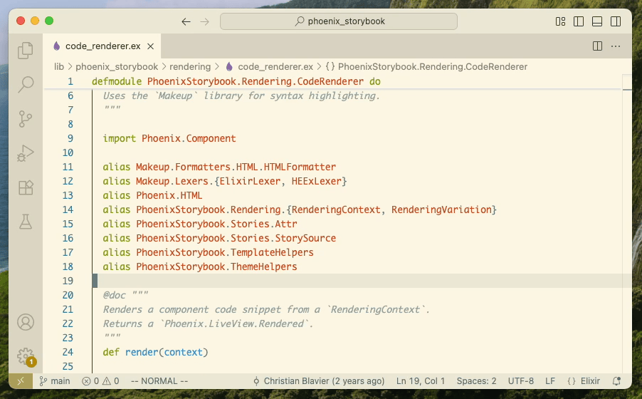

# Elixir Alias Autosorter

Automatically sorts aliases in Elixir modules on every save.
Never see _The alias X is not alphabetically ordered among its group_ again!

## Features

- Sorts aliases on every save (can be turned off)
- Sorts aliases on demand using the _Sort Elixir Aliases in File_ command
- Aliases are sorted only among its group (delimited by newlines or non-aliases)
- Multi-aliases (such as `alias Phoenix.{Controller, PubSub}`) are sorted as well
- Built to comply with `Credo.Check.Readability.AliasOrder`

## Configuration

- `elixirAliasAutosorter.sortOnSave` (defaults to `true`) – Controls whether aliases are sorted
  automatically on every save. If turned off, aliases will be sorted only when running the
  _Sort Elixir Aliases in File_ command.
- `elixirAliasAutosorter.includeGlob` (defaults to `"**/*.ex"`) – Defines
  a [glob pattern](https://code.visualstudio.com/docs/editor/glob-patterns) that is used to filter
  files autosorting will be applied to. You can use for example `**/*.{ex, exs}` if you also want
  to sort `.exs` files, or `{config,lib,test}/**/*.{ex,exs}` if you want to be more precise.
